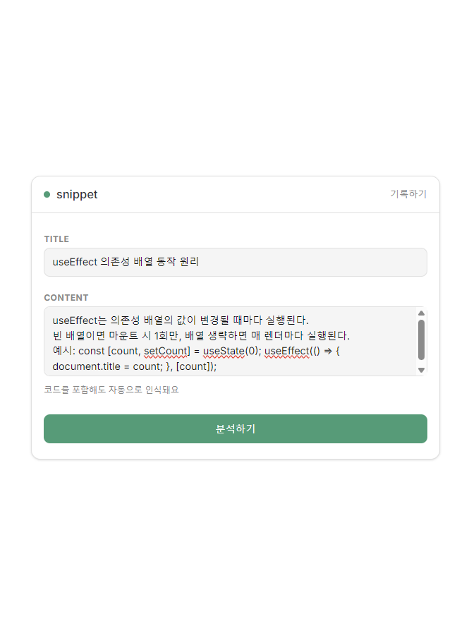
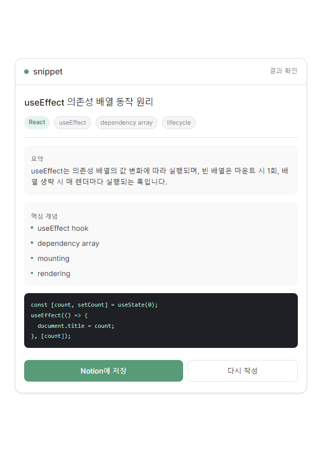
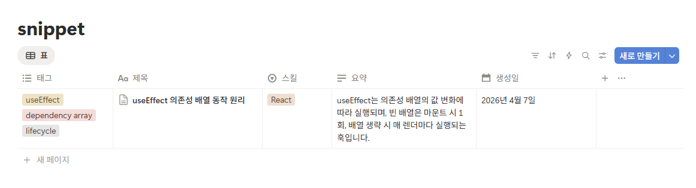
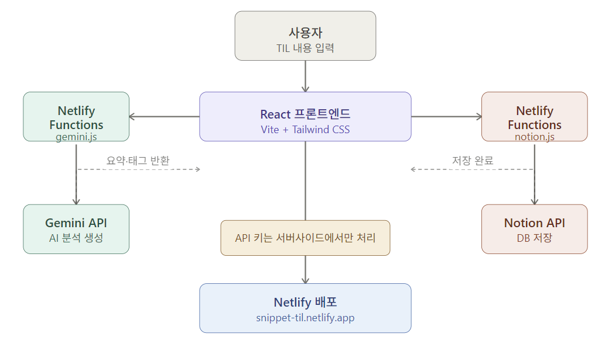

# 📝 Snippet — AI 기반 개발자 TIL 기록 도구

오늘 배운 것을 입력하면, AI가 요약·핵심 개념·태그를 자동 생성하고 Notion에 저장해줍니다.

**배포 URL:** https://snippet-til.netlify.app


</br>

## 🚀 주요 기능

- **AI 자동 분석** — 학습 내용을 입력하면 Gemini API가 요약, 핵심 개념, 태그, 코드 예시를 자동 생성
- **Notion 연동 저장** — 분석 결과를 Notion 데이터베이스에 바로 저장
- **스킬 태깅** — React, Node.js, CSS 등 기술 스택별로 분류
- **빈값 유효성 검사** — 필수 입력값 없이는 분석 버튼 비활성화

<table>
  <tr>
    <td align="center"><br/></td>
    <td align="center"><br/></td>
  </tr>
  <tr>
    <td colspan="2" align="center"><br/></td>
  </tr>
</table>

</br>

## 🛠 기술 스택

| 구분 | 기술 |
|---|---|
| Frontend | React, Vite, Tailwind CSS |
| AI | Gemini API (Google) |
| Database | Notion API |
| Serverless | Netlify Functions |
| Deployment | Netlify |


</br>

## 🏗 아키텍처



</br>

## ⚙️ 로컬 실행 방법

### 사전 준비

- Node.js 18+
- Netlify CLI (`npm i -g netlify-cli`)
- Deno (Edge Functions용, Windows의 경우 수동 설치 필요)
- Gemini API Key
- Notion API Key + Database ID

### 설치

```bash
git clone https://github.com/iam6ukk/snippet.git
cd snippet
npm install
```

### 환경변수 설정

프로젝트 루트에 `.env` 파일 생성:

```
GEMINI_API_KEY=your_gemini_api_key
NOTION_API_KEY=your_notion_api_key
NOTION_DATABASE_ID=your_notion_database_id
```

### 실행

```bash
netlify dev
```

> Windows에서는 Netlify CLI 권한 문제로 인해 터미널을 관리자 권한으로 실행해야 합니다.


</br>

## 🗂 Notion 데이터베이스 구조

| 속성명 | 타입 |
|---|---|
| 제목 | 제목 |
| 스킬 | 선택 |
| 요약 | 텍스트 |
| 태그 | 다중선택 |
| 생성일 | 날짜 |


</br>

## 🔐 환경변수 (Netlify 배포 시)

Netlify 대시보드 → Site configuration → Environment variables에 아래 3개 등록:

```
GEMINI_API_KEY
NOTION_API_KEY
NOTION_DATABASE_ID
```

> `VITE_` 접두사를 붙이면 클라이언트 번들에 노출되므로 사용하지 않습니다.


